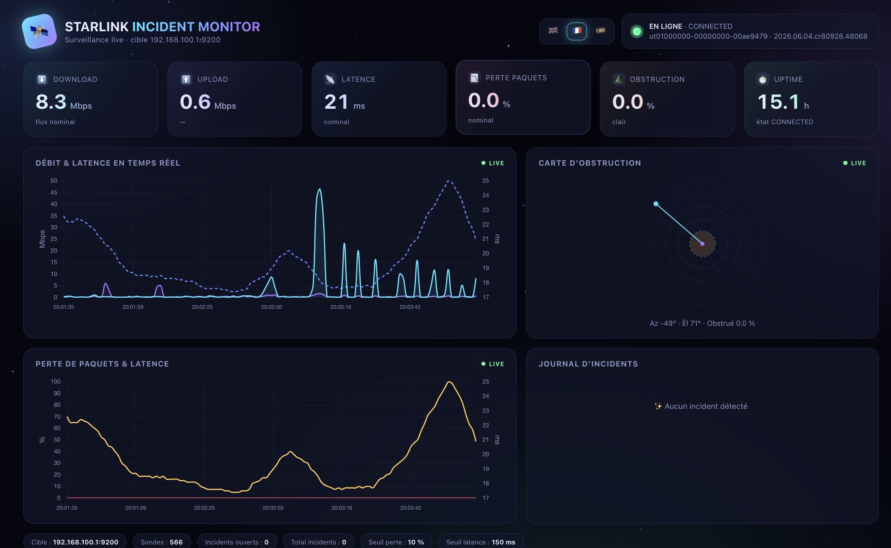

# 🛰️ Starlink Incident Monitor


[](https://www.python.org/)
[](LICENSE)

> 🌐 Idiomas / Langues: [Français](README.fr.md) · [English](README.md) (default) · **Español**



Aplicación web que supervisa continuamente una antena **Starlink** a través de
su API gRPC local (`192.168.100.1:9200`), detecta incidentes y muestra un
**panel de control en tiempo real muy estilizado** (tema espacial,
glassmorfismo, gráficos en vivo, mapa polar de obstrucciones, línea de tiempo
de incidentes).

## Funciones

- **Sondeo en vivo** de la antena (1 muestra/segundo) vía `grpcurl` (si la antena no es accesible, cambia automáticamente a **modo demo** y reintenta la antena real cada 15 segundos).
- **Detección de incidentes**:
  - 🛑 `outage` — antena inaccesible / desconexión
  - 📉 `packet_loss` — tasa de pérdida de paquetes > 10 %
  - 📡 `latency` — latencia > 150 ms
  - 🌲 `obstruction` — obstrucción de la señal
  - 🔻 `snr` — SNR por debajo del umbral de ruido
  - ⚠️ `alert` — alertas de hardware (motores bloqueados, limitación térmica, mástil no vertical, ethernet lento…)
- **Persistencia** de incidentes en `incidents.jsonl` (recargados al reiniciar).
- **Interfaz estilizada**: campo de estrellas animado, nebulosa, medidores neón, 2 gráficos en tiempo real (Chart.js), mapa polar de obstrucciones en SVG, línea de tiempo de incidentes con niveles de severidad.
- **Multilingüe 🇬🇧 🇫🇷 🇪🇸**: interfaz e incidentes traducidos al inglés, francés y español. El inglés es el idioma por defecto; selecciona otro idioma mediante las banderas en la esquina superior derecha. La elección se recuerda.

## Inicio rápido

```bash
cd /Users/laurentleplat/Web/starlink
./run.sh
```

Luego abre **http://127.0.0.1:5050**

> El puerto por defecto es `5050` (el puerto `5000` lo usa AirPlay Receiver en macOS).
> Para cambiarlo: `PORT=8000 ./run.sh`

### Sin el script

```bash
python3 -m venv .venv
.venv/bin/pip install -r requirements.txt        # runtime
.venv/bin/pip install -r requirements-dev.txt    # build + lint
.venv/bin/python app.py
```

### Calidad del código

```bash
.venv/bin/ruff check .          # lint
.venv/bin/black --check .       # formato
.venv/bin/mypy                  # análisis estático de tipos (strict, equivalente a PHPStan)
```

### Pruebas unitarias

```bash
.venv/bin/pytest                # 34 pruebas (detección, sondeo, parsing, persistencia, simulador, rutas)
```

Las pruebas cubren: la detección de incidentes (apertura/cierre, severidades y
anti-rebote), la reconexión automática, el parsing de la respuesta gRPC, la
persistencia JSONL, los límites del simulador demo y las rutas de Flask.

## Conexión a la antena real

La app llama a `grpcurl -plaintext 192.168.100.1:9200 SpaceX.API.Device.Device/Handle`.
Para usar la antena real:

1. Instala `grpcurl`: `brew install grpcurl` (o `go install github.com/fullstorydev/grpcurl/cmd/grpcurl@latest`).
2. Conéctate a la red Wi-Fi de la antena Starlink (la API solo es accesible localmente).
3. Inicia la app. Si la antena responde, el modo demo se desactiva automáticamente.

Variables de entorno:

| Variable            | Valor por defecto     | Función |
|--------------------|------------------------|---------|
| `STARLINK_TARGET`  | `192.168.100.1:9200`   | Destino gRPC de la antena |
| `STARLINK_POLL`    | `1.0`                  | Intervalo de sondeo (s) |
| `STARLINK_RETRY`   | `15.0`                 | Intervalo de reconexión en modo demo automático (s) |
| `STARLINK_DEMO`    | (auto)                | `1` para forzar el modo demo |
| `STARLINK_GRPCURL` | (auto)                | Ruta al binario grpcurl |
| `HOST`             | `127.0.0.1`            | Host de escucha (localhost por defecto) |
| `PORT`             | `5050`                 | Puerto del servidor web |

## Arquitectura

```
app.py                 → backend Flask + hilo de sondeo + detección de incidentes
  ├── _try_grpcurl()       consulta la antena vía grpcurl (JSON)
  ├── _parse_status()      convierte el JSON gRPC en Sample + info de la antena
  ├── DemoSimulator        datos simulados realistas (modo demo)
  ├── MonitorState         muestras + incidentes + detección (abierto/cerrado)
  └── /api/state, /api/incidents, /
templates/index.html   → panel estilizado (estrellas, medidores, gráficos, radar, línea de tiempo)
incidents.jsonl        → registro persistente de incidentes
```

## Umbrales de detección (configurables al principio de `app.py`)

| Parámetro          | Valor | Incidente disparado |
|--------------------|-------|---------------------|
| `TH_DROPRATE`      | 0.10  | pérdida de paquetes > 10 % |
| `TH_LATENCY`       | 150 ms| pico de latencia |
| `TH_OBSTRUCTION`   | 5 %   | obstrucción de la señal |
| `ALERT_FIELDS`     | …     | alertas de hardware de Starlink |

## Empaquetado macOS (.app + .dmg)

La aplicación puede empaquetarse como una app nativa de macOS (ventana WebKit
vía pywebview) y luego en un instalador DMG. El DMG **no** se incluye en el
repositorio (artefacto de build, demasiado grande): se compila localmente.

**Requisitos previos**: macOS (Apple Silicon preferido), Xcode command line
tools, y `grpcurl` (incluido en la app):

```bash
xcode-select --install
brew install grpcurl
.venv/bin/pip install -r requirements-dev.txt   # pyinstaller, pillow, pywebview…
```

**Compilación**:

```bash
.venv/bin/python build_icon.py                              # 1. genera el icono .icns
.venv/bin/python -m PyInstaller StarlinkMonitor.spec --noconfirm   # 2. build .app
./build_dmg.sh                                              # 3. build .dmg
```

El resultado está en `dist/StarlinkMonitor.dmg`. El binario `grpcurl` y los
assets estáticos (Chart.js) están incluidos — la app funciona sin conexión.

> `StarlinkMonitor.spec` resuelve `grpcurl` desde la variable `STARLINK_GRPCURL`
> o el `PATH`. Para forzar un binario: `STARLINK_GRPCURL=/ruta/a/grpcurl`.
>
> La app está firmada *ad-hoc*. En el primer inicio macOS puede bloquearla:
> clic derecho en la app → **Abrir** → confirmar.
> Build actual: **arm64** (Apple Silicon). Para Intel, recompila en una máquina x86_64.

## Notas

- La API gRPC local de Starlink no es oficial y no está soportada por SpaceX — puede cambiar.
- Modo demo: se activa automáticamente si falta `grpcurl` o la antena es inaccesible, para que la interfaz siga siendo demostrable.
- **100 % sin conexión**: Chart.js está incluido localmente (`static/`), el panel funciona sin Internet.
- El servidor web solo escucha en `127.0.0.1` por defecto (seguridad); sobrescribe con `HOST=0.0.0.0` para acceso de red.
